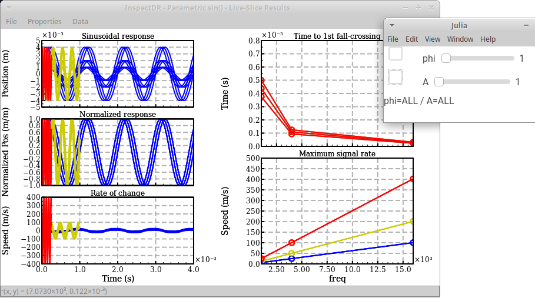

<!-- Reference-style links to make tables & lists more readable -->
[CMDimData]: <https://github.com/ma-laforge/CMDimData.jl>
[InspectDR]: <https://github.com/ma-laforge/InspectDR.jl>
[CMDimData_SamplePlots]: <https://github.com/ma-laforge/CMDimData.jl/tree/master/sample/plots>

# Generated with CMDimData.jl

This directory stores outputs of [CMDimData] sample scripts, rendered with the [InspectDR] backend.

## `analysis_fmtinline/demo1.jl`

## `LiveSlice/parametric_sin_slice.jl`

### Overlay all amplitudes & phases

### Show only `A=0.004`, `phi=0`

## `demo1.jl`-`demo5.jl`
Outputs from the [sample/plots/][CMDimData_SamplePlots] subdirectory, rendered with the InspectDR backend.

### `demo1.jl`

### `demo2.jl`

### `demo3.jl`

### `demo4.jl`

### `demo5.jl`

