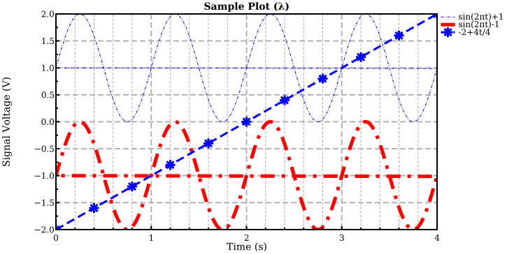
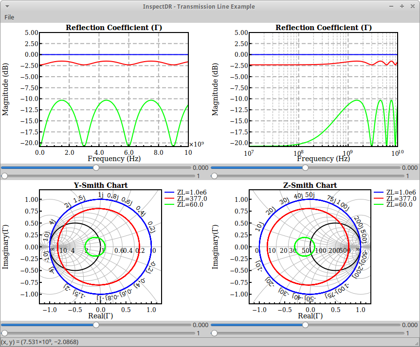
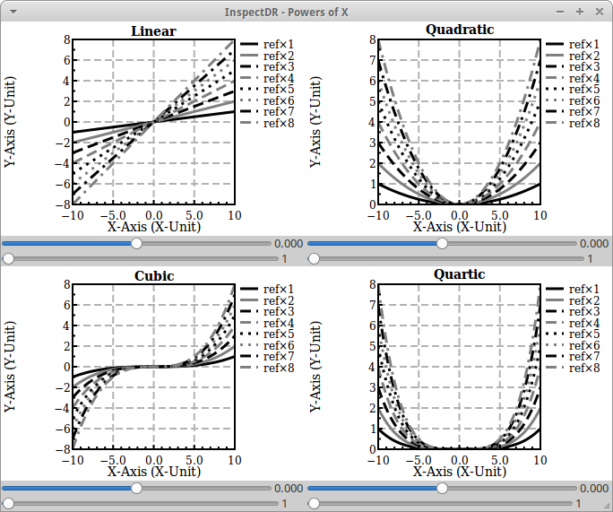
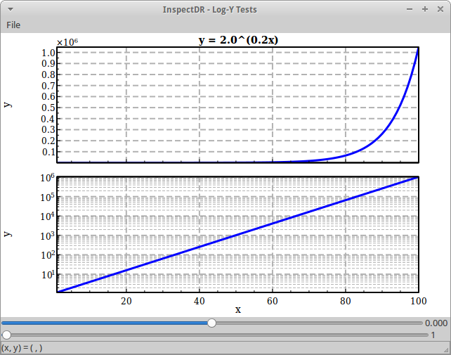

# InspectDR.jl: Sample plots

The following plots were generated with the [InspectDR.jl](https://github.com/ma-laforge/InspectDR.jl) module.

## demo1: Sine Waves

## demo1 + Box Zoom

## demo1 (SVG)
If inline image below does not display, click [here](demo1.svg) to load directly.

## demo2: Reflection Coefficients

## demo3: Powers of X

## demo4: Undefined Extents

## demo5: Log-Y Axis

## demo6: Smith Chart (Publication Layout)

