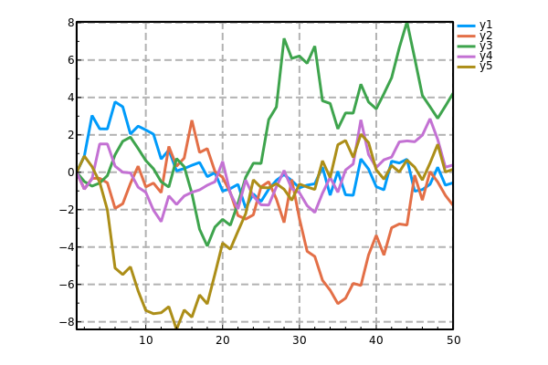
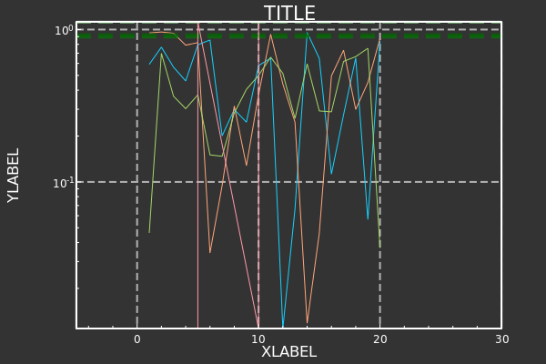
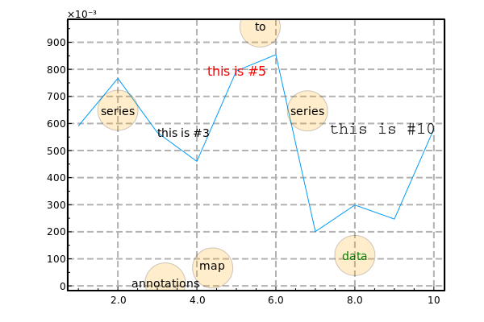
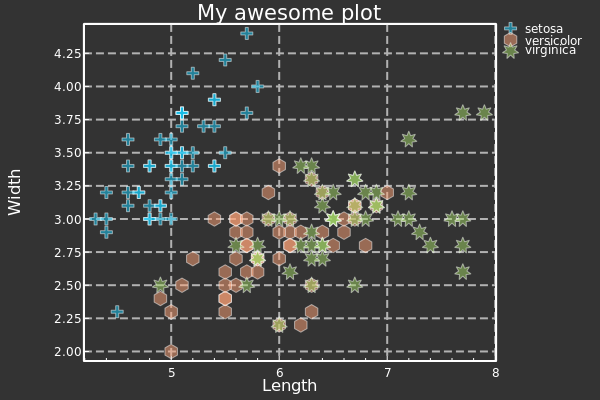
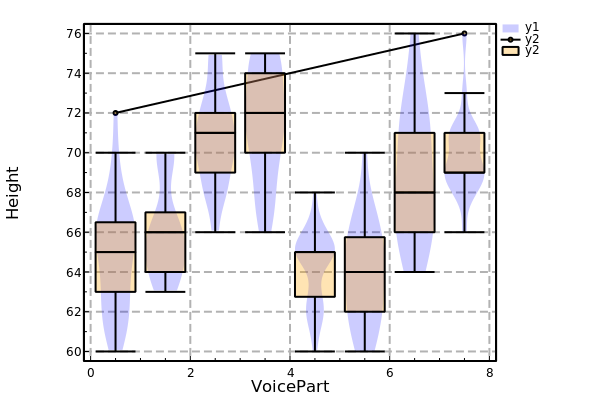

# InspectDR.jl: Plots.jl Test Plot Output.

The following plots were generated from built-in test of the [Plots.jl](https://github.com/JuliaPlots/Plots.jl) module, using [InspectDR.jl](https://github.com/ma-laforge/InspectDR.jl) as the "backend".

## Test #1: Lines

## Test #5: Global

## Test #20: Annotations

## Test #25: DataFrames

## Test #30: Boxplot and Violin Series Recipes

