# Generated With SignalProcessing.jl

The following plots were generated with [InspectDR](https://github.com/ma-laforge/InspectDR.jl) using the simplified plot interface provided by EasyPlotInspect.jl.

### Comments
 - SignalProcessing.jl, EasyPlotInspect.jl & InspectDR.jl are all part of the [CData.jl](https://github.com/ma-laforge/CData.jl) analysis suite.
 - To view (older) plots generated by GracePlot.jl/Grace instead, click [here](./grace_old/README.md).

## demo1
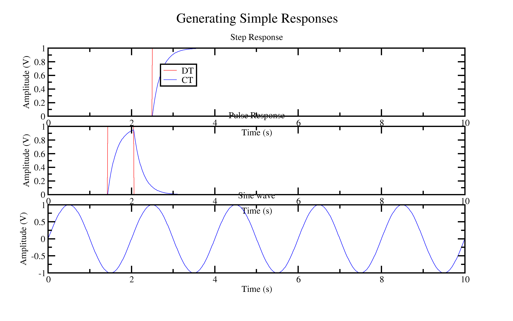

## demo2
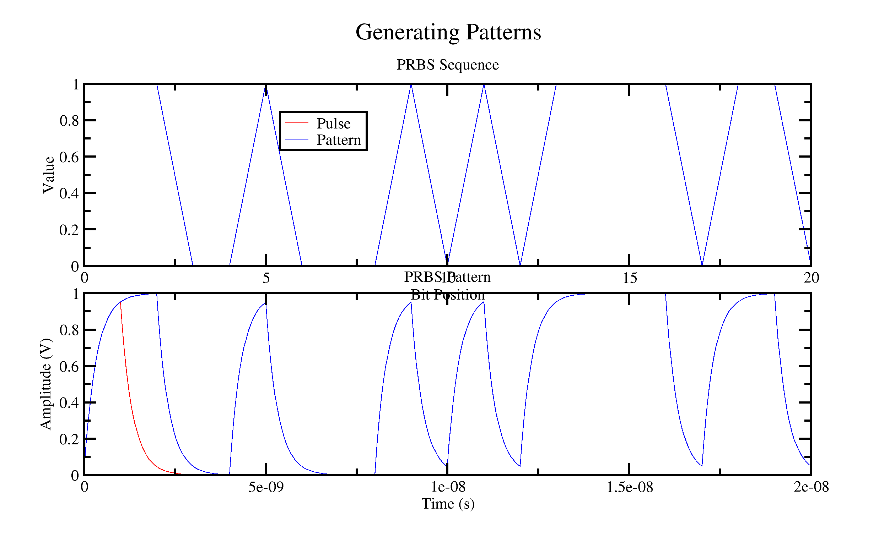

## demo3
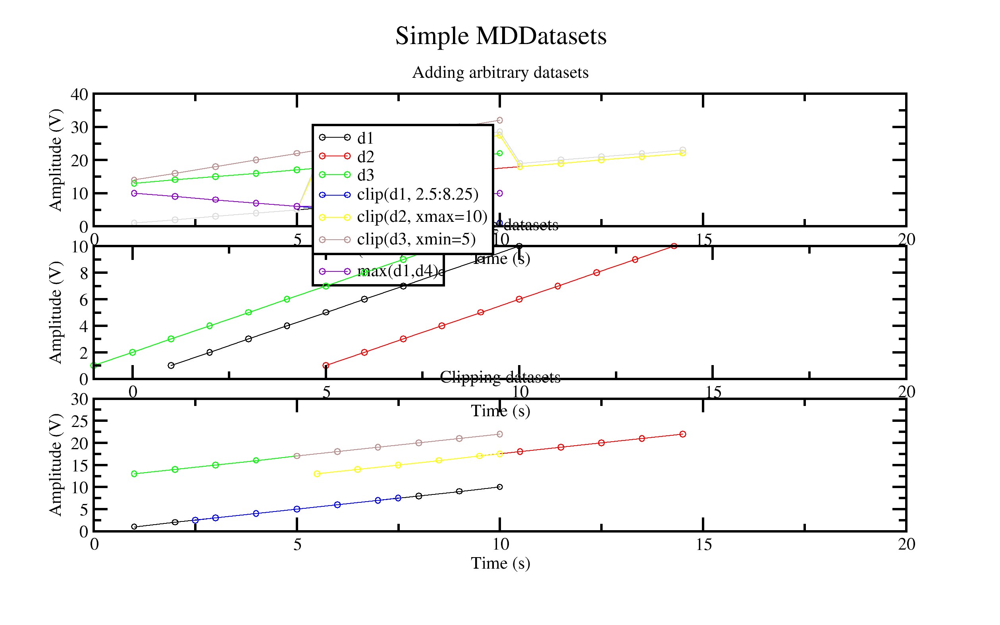

## demo4

## demo5
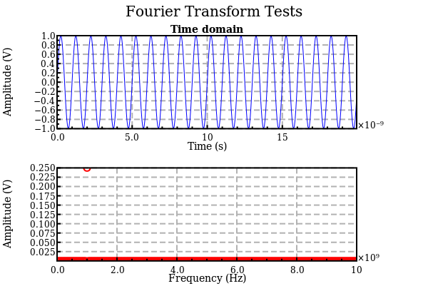

## demo6
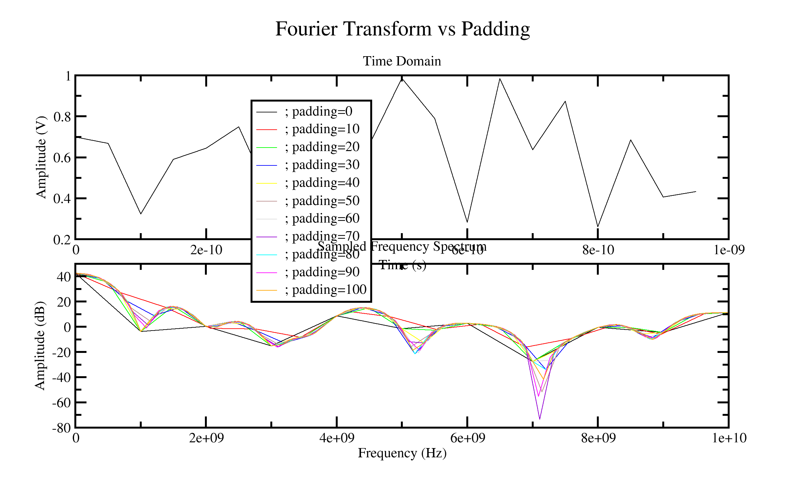

## demo7
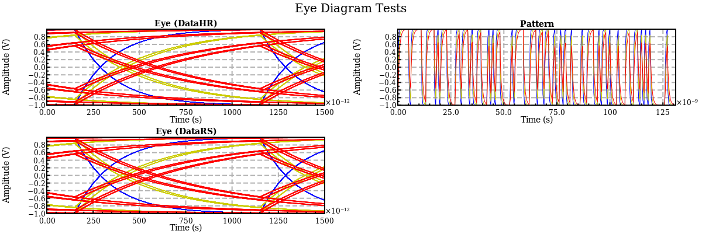

## demo8
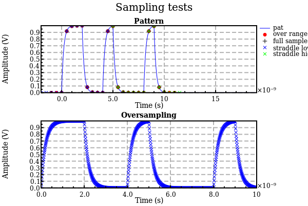

## demo9
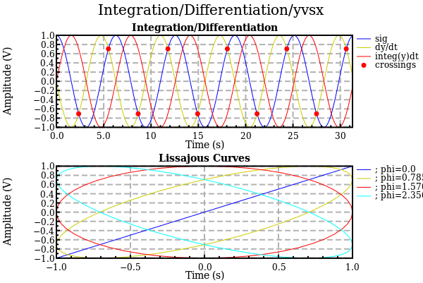

## demo10
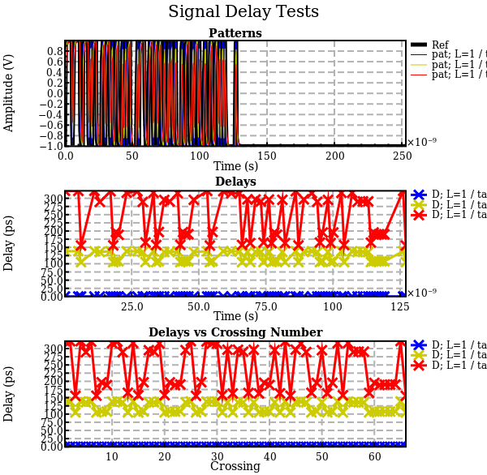

## demo11
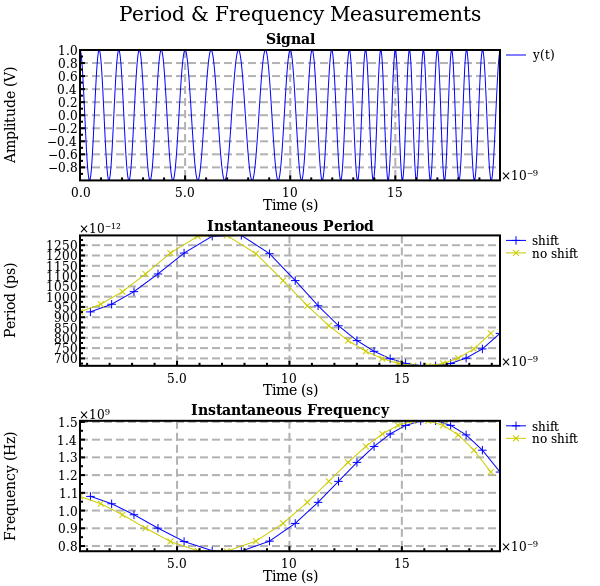

## demo12
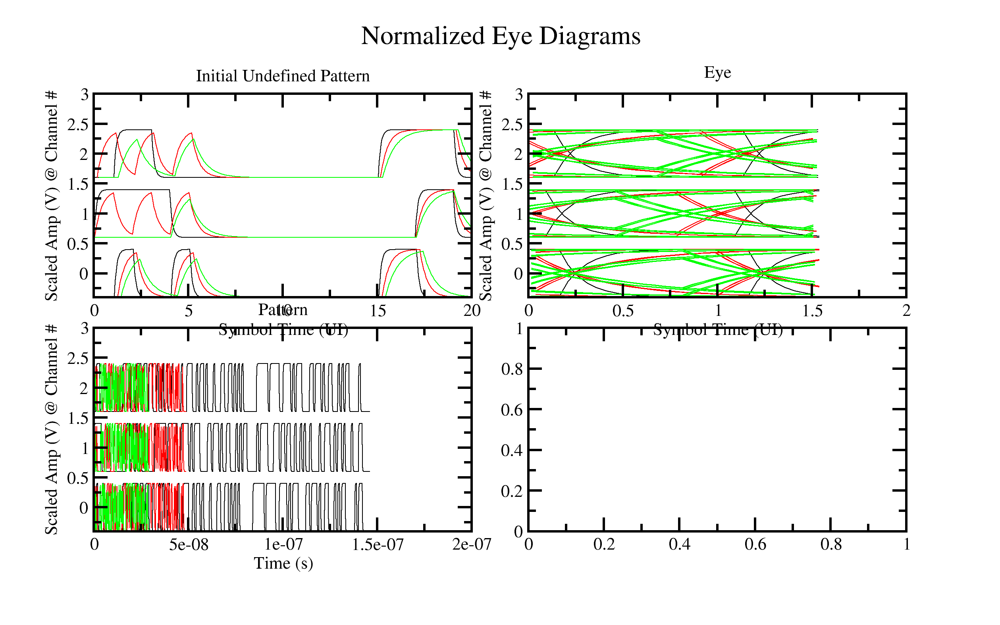

## demo13
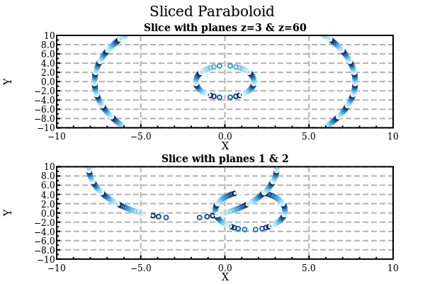

## demo14
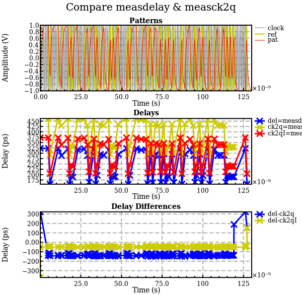

## demo15
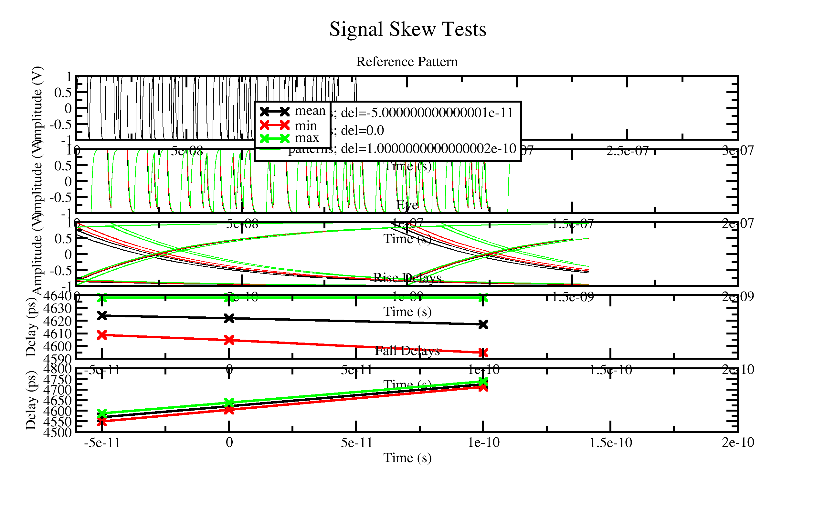

## demo16
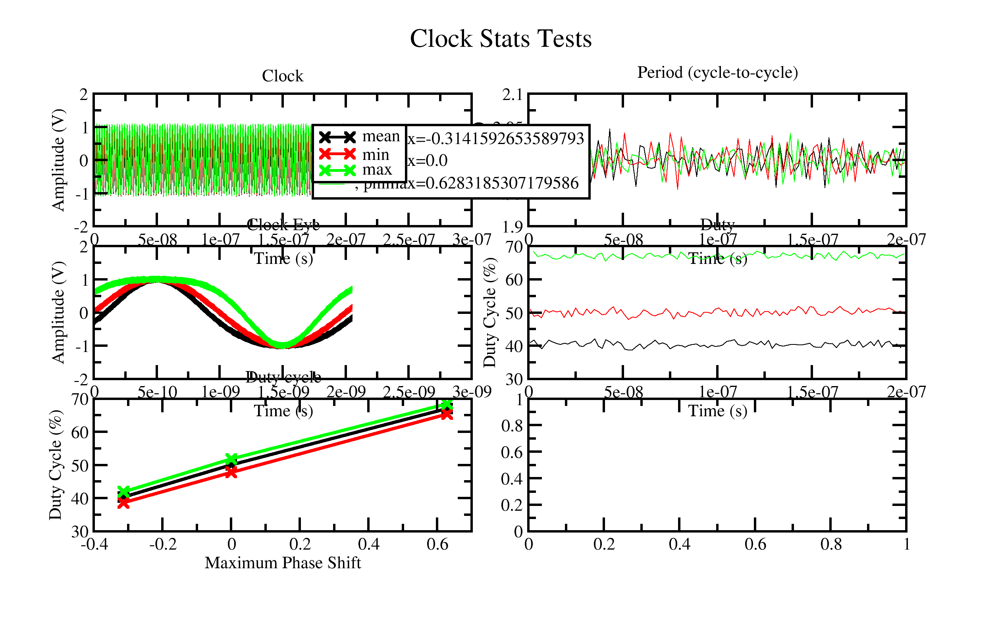

## demo17
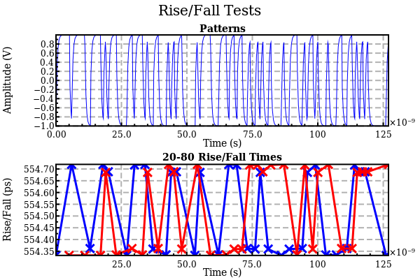

