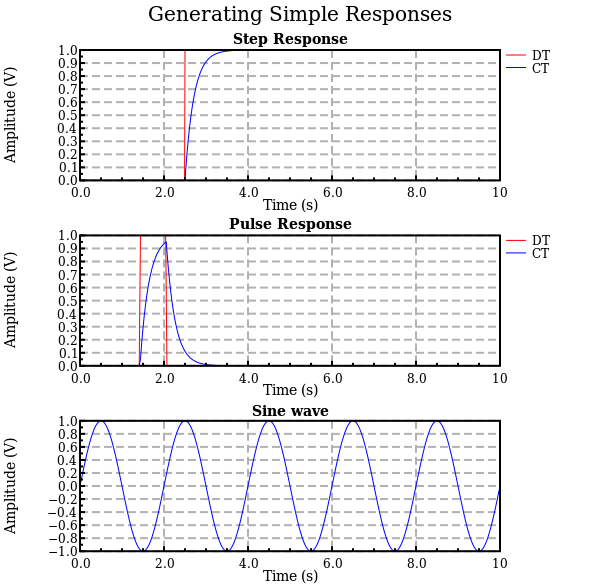
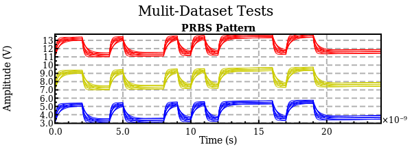

<!-- Reference-style links to make tables & lists more readable -->
[CMDimCircuits]: <https://github.com/ma-laforge/CMDimCircuits.jl>
[CMDimData]: <https://github.com/ma-laforge/CMDimData.jl>
[GracePlot]: <https://github.com/ma-laforge/GracePlot.jl>
[InspectDR]: <https://github.com/ma-laforge/InspectDR.jl>
[CMDimData_SamplePlots]: <https://github.com/ma-laforge/CMDimData.jl/tree/master/sample/plots>

# Outputs: CMDimCircuits.jl (SignalProcessing module)

This directory stores outputs of [CMDimCircuits] sample scripts, rendered with the [InspectDR] backend.

### Comments
 - To view (older) plots rendered with the [Grace][GracePlot] backend instead of [InspectDR], click [here](./grace_old/README.md).

## `demo1.jl`

## `demo2.jl`

## `demo3.jl`

## `demo4.jl`

## `demo5.jl`

## `demo6.jl`

## `demo7.jl`

## `demo8.jl`

## `demo9.jl`

## `demo10.jl`

## `demo11.jl`

## `demo12.jl`

## `demo13.jl`

## `demo14.jl`

## `demo15.jl`

## `demo16.jl`

## `demo17.jl`

