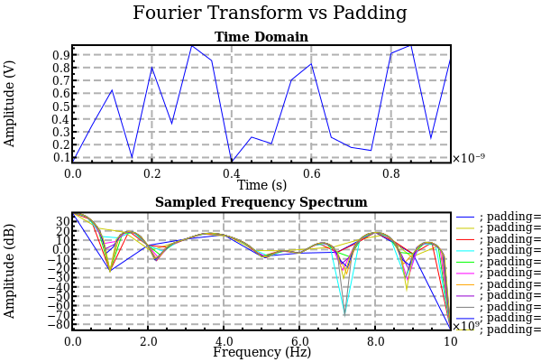
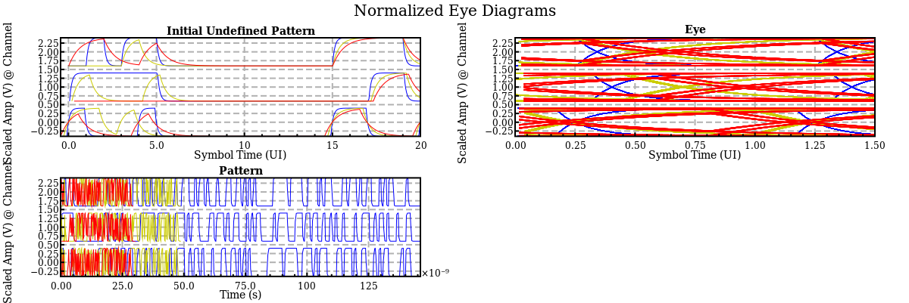

# Generated With SignalProcessing.jl

The following plots were generated with [InspectDR](https://github.com/ma-laforge/InspectDR.jl) using the simplified plot interface provided by EasyPlotInspect.jl.

### Comments
 - SignalProcessing.jl, EasyPlotInspect.jl & InspectDR.jl are all part of the [CData.jl](https://github.com/ma-laforge/CData.jl) analysis suite.
 - To view (older) plots generated by GracePlot.jl/Grace instead, click [here](./grace_old/README.md).

## demo1

## demo2

## demo3

## demo4

## demo5

## demo6

## demo7

## demo8

## demo9

## demo10

## demo11

## demo12

## demo13

## demo14

## demo15

## demo16

## demo17

