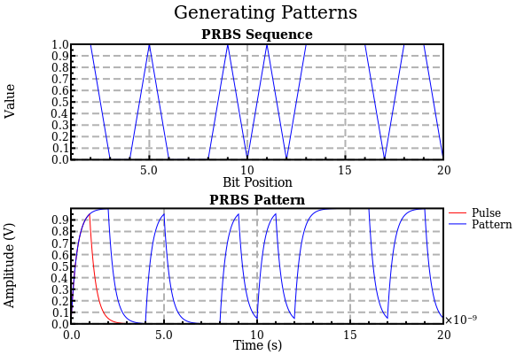
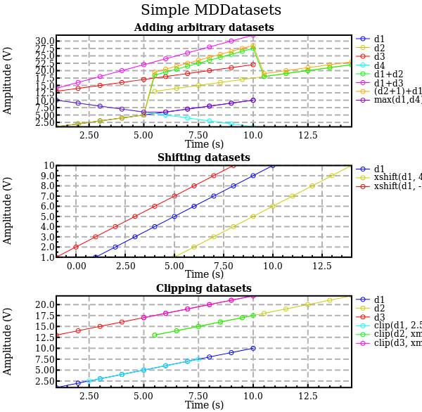
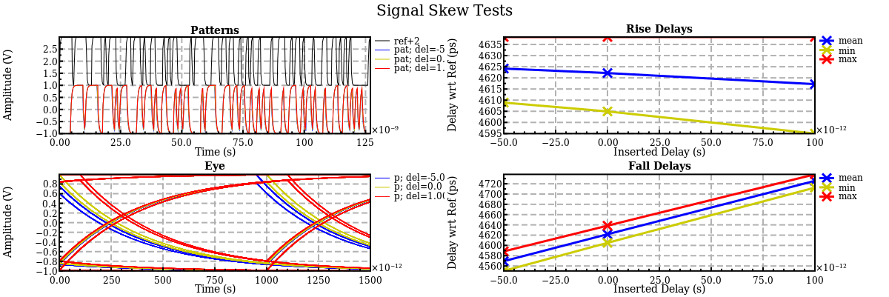
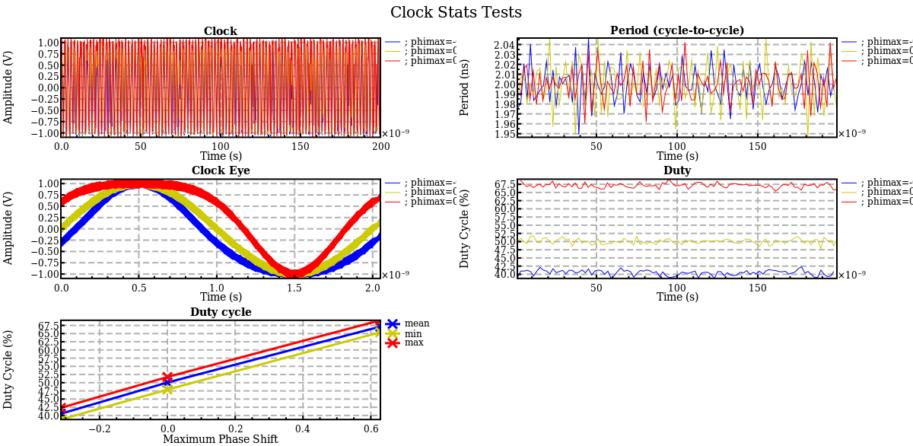

# Generated With SignalProcessing.jl

## Comments

The following plots were generated with [GracePlot](https://github.com/ma-laforge/GracePlot.jl) (using Grace).

Please note that GracePlot defaults do not currently provide optimal results when multiple subplots (called "graphs") are involved.  Axis titles, tick labels, legends, and graphs themselves will overlap in a non-ideal fashion.

A more representative example of what *can* be obtained with grace is presented [here](../../GracePlot/sampleplots/graceplot2x2.png).  This result was generated using "templates" (see "parameter files"), but can also be achieved through manual intervention with the Grace UI.

## demo1

## demo2

## demo3

## demo4

## demo5

## demo6

## demo7

## demo8

## demo9

## demo10

## demo11

## demo12

## demo13

## demo14

## demo15

## demo16

